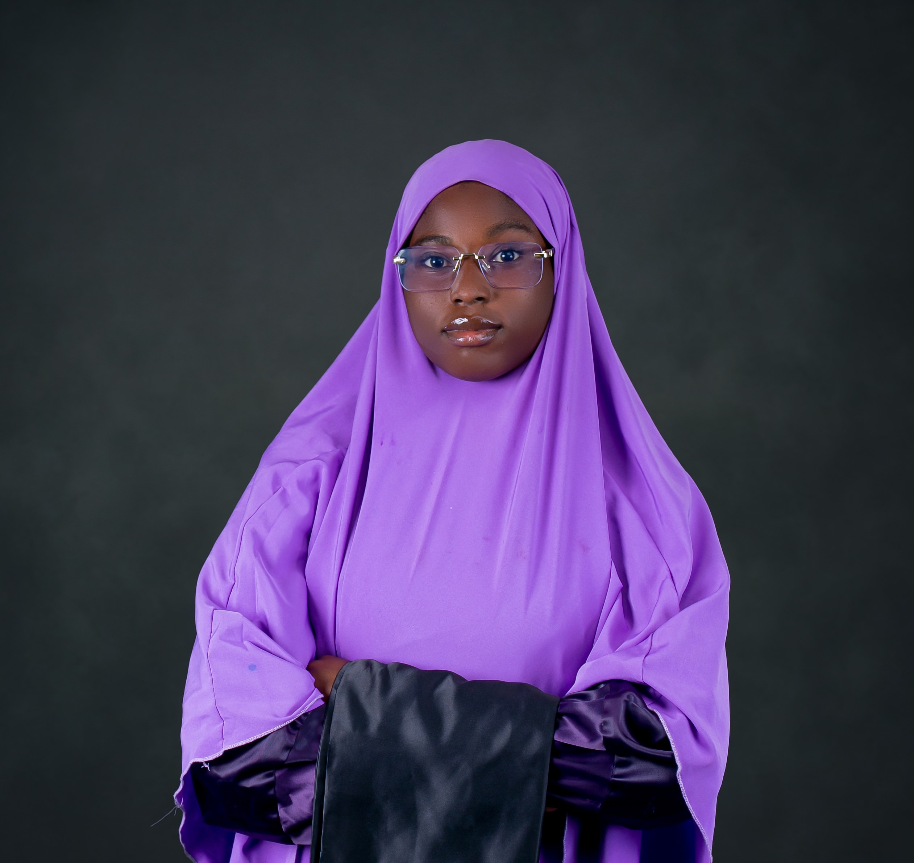

Yaml

---
Layout: Default
Title: Ambali Ayishat
---
Html
<!-- CSS for side-by-side intro -->

<!-- Intro with side-by-side picture -->

  <!-- Picture -->
  

  <!-- Details -->
  

    <h1>👋 Hi, I’m Ambali Ayishat</h1>
    

      I am a <strong>Data Analyst</strong> with a passion for turning data into actionable insights.
      A graduate of <strong>Pharmacology &amp; Therapeutics</strong>, I am now chasing my dream in
      <strong>Oncology and Research</strong>, blending science with analytics to make meaningful impact.
      I love solving complex problems, uncovering patterns in data, and exploring new ways to bring ideas to life.
    

  

---

## 🛠 Skills
- Data Analysis &amp; Visualization (Excel, Python, SQL)  
- Data Cleaning &amp; Transformation  
- Statistical Modeling  
- Dashboard Creation (Power BI, Tableau)  
- Problem Solving &amp; Critical Thinking

---

## 📫 Contact Me
You can reach me at:  
- **Email:** ambaliayishat88@gmail.com  
- **LinkedIn:** www.linkedin.com/in/ambali-ayishat-222910254 
- **GitHub:** https://khedash.github.io/Portfolio/

